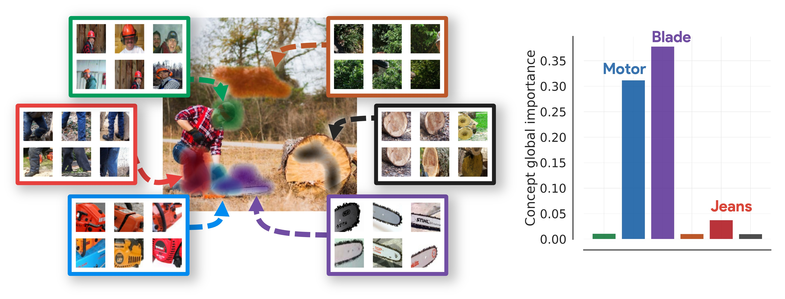
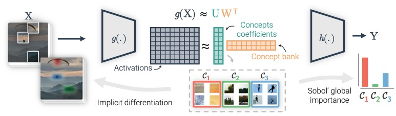
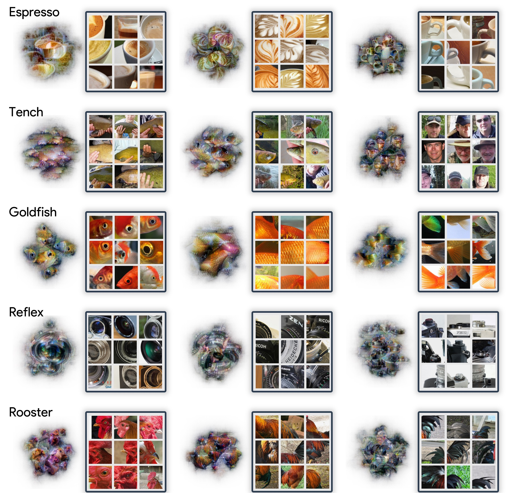

# 👋 CRAFT: Concept Recursive Activation FacTorization for Explainability (CVPR 2023)

This repository contains code for the paper:

*CRAFT: Concept Recursive Activation FacTorization for Explainability*, Thomas Fel*, Agustin Picard*, Louis Bethune*, Thibaut Boissin*, David Vigouroux, Julien Colin, Rémi Cadène, Thomas Serre. CVPR 2023, [[arXiv]](https://arxiv.org/abs/2211.10154).

The code is implemented and available **for Pytorch & Tensorflow**. A notebook for each of them is available: 
- [ Notebook for Pytorch](./craft_pytorch.ipynb)
-  [ Notebook for Tensorflow](./craft_tensorflow.ipynb).


# 🚀 Quick Start

Craft requires a version of python higher than 3.6 and several libraries like Numpy, also you will need either Tensorflow or Torch. Installation can be done using Pypi:

```bash
pip install Craft-xai
```

Now that Craft is installed, here is the basic example of what you can do. 
The API, whether for Tensorflow or Pytorch, is similar and only requires two hyperparameters. First, you need to load your models and a set of images from a class you want to explain (generally, try to have at least 500 images).

Once you have that, split your model into two parts (see the notebooks if necessary) to have two functions: $g$, which maps from the input to the feature space, and $h$, which maps from the feature space to your logits. Once you have done this, you are ready to instantiate CRAFT.

```python
from craft.craft_torch import Craft
# or
#from craft.craft_tf import Craft


craft = Craft(input_to_latent=g,
              latent_to_logit=h,
              number_of_concepts=10,
              patch_size=64,
              batch_size=64)
```

Now, you can fit CRAFT with your preprocessed images (make sure they are preprocessed according to your model).

```python
crops, crops_u, w = craft.fit(images_preprocessed)
importances = craft.estimate_importance(images_preprocessed, class_id=class_id) # the logit you want to explain
```

That's it! To learn how to visualize the results, refer to the notebooks that explain how to make the most of all the information returned by CRAFT.






# Citation

```
@inproceedings{fel2023craft,
      title={CRAFT: Concept Recursive Activation FacTorization for Explainability},
      author={Thomas, Fel and Agustin, Picard and Louis, Bethune and Thibaut, Boissin and David, Vigouroux and Julien, Colin and Rémi, Cadène and Thomas, Serre},
      year={2023},
      booktitle={Proceedings of the IEEE Conference on Computer Vision and Pattern Recognition (CVPR)}
}
```

# More about CRAFT

The code for the metrics and the other attribution methods used in the paper come from the [Xplique toolbox](https://github.com/deel-ai/xplique).

<a href="https://github.com/deel-ai/xplique">
    
</a>


Additionally, we have created a website called the [LENS Project](https://github.com/serre-lab/Lens), which features the 1000 classes of ImageNet.

<a href="https://github.com/serre-lab/Lens">
    
</a>


# Authors of the code

- [Thomas Fel](https://thomasfel.fr) - thomas_fel@brown.edu, PhD Student DEEL (ANITI), Brown University
- [Agustin Picard]() - agustin-martin.picard@irt-saintexupery.com, IRT Saint-exupéry, DEEL
- [Louis Béthune]() - louis.bethune@univ-toulouse.fr, PhD Student DEEL (ANITI)
- [Thibaut Boissin]() - thibaut.boissin@irt-saintexupery.com, IRT Saint-exupéry,